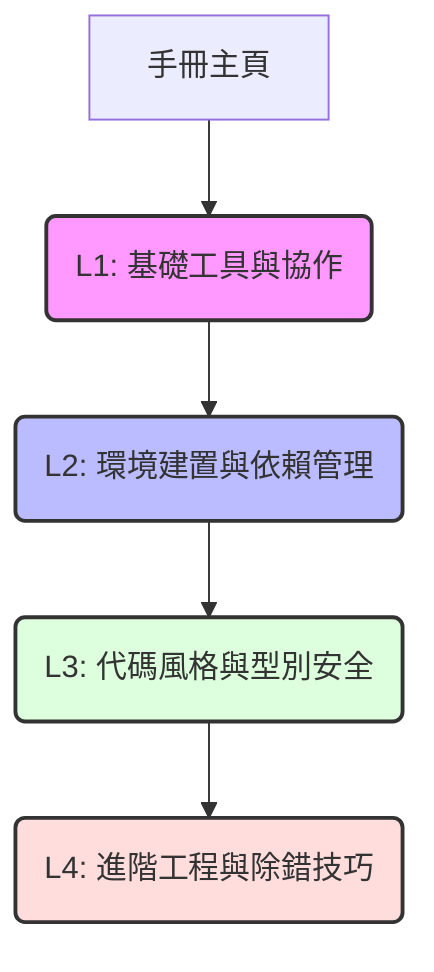

# 附錄總覽與知識庫地圖

歡迎來到 AGILAB 附錄知識庫！本附錄旨在為你提供手冊核心流程之外的背景工具知識、踩坑指南與進階工程實作。

為了讓不同背景的同學可以按部就班地補齊知識，我們將附錄內容劃分為 **四個層次**。你可以根據自己的熟練度與專案需求，選擇跳轉閱讀對應的文件：

---

## 🗺️ 知識庫地圖

---

## 🎯 第一層：基礎工具與協作 (L1)
如果你從未接觸過軟體開發的版本控制、或是第一次參與實驗室協作專案，請先由此開始：

* **[Git 與 GitHub 入門](git_github_intro.md)**
    * **核心內容**：介紹 Git 版本控制（拍照與時光機）、GitHub 雲端協作、Clone、Branch、以及 Pull Request（PR）的關係。
    * **新版補充**：增加了 Git 常見衝突（Conflict）的解決流程與常用恢復指令。
    * **對應手冊**：日常開發時請搭配 [日常 Git 操作](../development/daily_git.md) 與 [快速啟動](../getting_started/contributing.md) 閱讀。

---

## 📦 第二層：環境建置與依賴管理 (L2)
管理研究專案的第三方軟體包、物理模擬器與 GPU 容器化，是保證實驗「可重現性」的基礎：

* **[Conda 與 environment.yml 說明](conda_env_guide.md)**
    * **核心內容**：為什麼要用 Conda？`environment.yml` 的結構、日常維護（新增套件）與從零建置。
    * **新版補充**：Conda 依賴解析過慢原因（Channel 優先級）、環境垃圾清理與瘦身導出。
* **[開發模式安裝 (Editable Install)](editable_install.md)**
    * **核心內容**：介紹 `pip install -e .` 的軟連結（symlink）機制，以及為什麼研究專案非用它不可。
    * **新版補充**：修改 `pyproject.toml` 中的 entry points 時重新安裝的提醒。
* **[pyproject.toml 說明](pyproject_guide.md)**
    * **核心內容**：解密 `pyproject.toml` 設定檔、Ruff 程式碼檢查規則集、以及將程式碼發布為 Python 套件或 GitHub Release 的流程。
* **[Docker 容器化部署](docker_guide.md)**
    * **核心內容**：何時該用 Docker？基本 Dockerfile 設計與支援 GPU 容器共享的 `docker-compose.yml` 寫法。
    * **新版補充**：NVIDIA Container Toolkit 的 GPU 配對設定、與容器內非 root 用戶權限處理實戰。
* **[tmux 無 sudo 安裝教學](tmux_guide.md)**
    * **核心內容**：伺服器上沒有 `sudo` 權限時，如何用 Conda 安裝 tmux，並使用 session 來維持實驗背景執行。

---

## 🎨 第三層：代碼風格與型別安全 (L3)
寫出乾淨、有型別提示且易於 review 的程式碼，是團隊協作的最高準則：

* **[Google Python Style Guide 要點](google_style_guide.md)**
    * **核心內容**：命名規範（Snake vs Pascal）、行長（88 字元）、引號、Import 順序，以及 Ruff 自動檢查工具。
* **[Type Hinting 入門](type_hinting.md)**
    * **核心內容**：函式型別標註、常見類型、與靜態檢查工具的作用。
    * **新版補充**：實用型別標記（`Union` 聯合型別、`Any` 任意型別、`Type Alias` 別名）的寫法與規範。
* **[Google Style Docstrings 範例](docstrings.md)**
    * **核心內容**：如何撰寫符合規範的 Args、Returns 與 Raises 區塊。
    * **新版補充**：VS Code 與 PyCharm 中自動產生 Google Docstring 的延伸套件配置。

---

## 🛠️ 第四層：進階工程與除錯技巧 (L4)
當你的專案逐漸龐大，或者涉及複雜的神經網路訓練與物理模擬器時，這些技巧將幫助你快速除錯與保護程式穩定：

* **[進階測試技巧](testing_advanced.md)**
    * **核心內容**：使用 pytest 來撰寫測試。
    * **新版補充**：如何使用 pytest fixture 共享測試實例、以及使用 `monkeypatch` 或 mock 模擬外部硬體/網路 API。
* **[進階 Logging 與除錯](logging_advanced.md)**
    * **核心內容**：如何用 Logging 系統全面取代 Print，並掌握 Traceback 與除錯流程。
    * **新版補充**：配置 console（終端機）與 file（檔案）雙輸出 Logger 的最佳實作設定。

---

**手冊主頁** [回到手冊主頁](../index.md)
