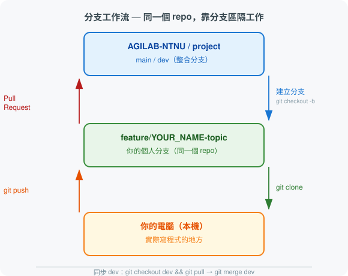

# 快速啟動

歡迎來到 AGILAB！本頁說明你加入新專案後的一次性初始化流程。

!!! info "第一次接觸 Git 或 GitHub？"
    本頁會用到 Clone、分支（Branch）等概念。不熟悉的話請先看 → [Git 與 GitHub 入門](../appendix/git_github_intro.md)

!!! warning "實驗室不開放 Fork"
    所有人共用同一個實驗室 repo，靠**分支（Branch）**區隔每個人的工作，不開放個人 Fork。請依下方流程申請協作者權限後直接 Clone 實驗室 repo。

---

## 兩個地方、一條主線

初次接觸分支工作流時，最容易搞混的是「我現在的程式碼在哪裡」。先看這張圖：



- **實驗室 repo**（藍／綠色）：唯一的程式碼來源，`main`、`dev` 與每個人的 `feature/[name]` 分支都在這裡
- **本機**（橘色）：你實際寫程式的地方

同步方向：`dev → feature/[name] → 本機`（拉取更新）
提交方向：`本機 → feature/[name] → PR → dev`（送出更動）

---

## 初始化流程（只做一次）

### 步驟 1：取得協作者權限

請老師或學長姐將你加入實驗室 repo 的 GitHub Collaborator 名單。實驗室不使用 Fork，所有人都直接在同一個 repo 裡用分支工作。

### 步驟 2：Clone 實驗室 repo

```bash
git clone https://github.com/AGILAB-NTNU/project.git
cd project
```

### 步驟 3：建立你的個人分支

```bash
git checkout dev
git pull
git checkout -b feature/your-name-topic
```

當隊友的 PR 被合入 `dev` 後，這樣把更新同步回你的分支：

```bash
git checkout dev
git pull
git checkout feature/your-name-topic
git merge dev
```

### 步驟 4：重命名核心資料夾

把模板的佔位名稱換成你的實際專案名稱（例如 `my_robot_rl`）：

```bash
mv src/project_name src/my_robot_rl
```

重命名後需要同步更新**所有**引用到舊名稱的地方，否則 `import` 會失敗：

!!! warning "重命名 Checklist — 四個地方都要改"
    - [ ] `pyproject.toml` 的 `name = "project_name"` → `name = "my_robot_rl"`
    - [ ] `tests/` 內所有 `from project_name` 或 `import project_name` → 換新名稱
    - [ ] `scripts/` 內所有腳本裡的 `import project_name` → 換新名稱
    - [ ] `src/my_robot_rl/__init__.py` 確認無誤（通常不需改，但確認一下）

`pyproject.toml` 的修改範例：

```toml
[project]
name = "my_robot_rl"   # ← 改成實際專案名稱
```

### 步驟 5：建立 Conda 環境並驗證

```bash
conda env create -f environment.yml
conda activate agilab_env
python -c "import my_robot_rl; print('安裝成功！')"
```

如果出現 `ModuleNotFoundError`，通常是步驟 4 有某個地方漏改，或 `pip install -e .` 還沒跑。先執行：

```bash
pip install -e .
```

!!! tip "想知道每個資料夾是做什麼的？"
    → [專案模板結構說明](template_structure.md)

---

**下一步 →** [環境管理](conda_guide.md)
