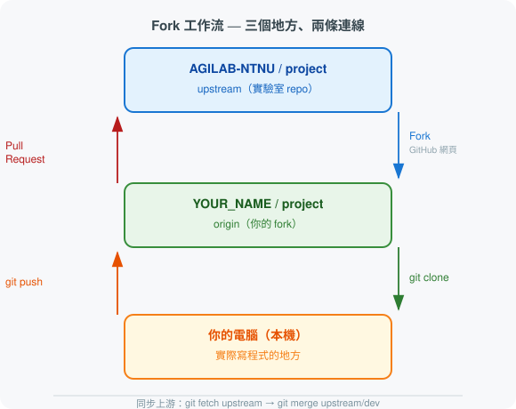

# 快速啟動

歡迎來到 AGILAB！本頁說明你加入新專案後的一次性初始化流程。

!!! info "第一次接觸 Git 或 GitHub？"
    本頁會用到 Fork、Clone、upstream 等概念。不熟悉的話請先看 → [Git 與 GitHub 入門](../appendix/git_github_intro.md)

---

## 三個地方、兩條連線

初次接觸 Fork 工作流時，最容易搞混的是「我現在的程式碼在哪裡」。先看這張圖：



- **upstream**（藍色）：實驗室的官方 repo，所有人的 PR 都合進這裡
- **origin**（綠色）：你自己的 fork，你平時 push 到這裡
- **本機**（橘色）：你實際寫程式的地方

同步方向：`upstream → origin → 本機`（拉取更新）
提交方向：`本機 → origin → PR → upstream`（送出更動）

---

## 初始化流程（只做一次）

### 步驟 1：Fork 實驗室 repo

前往實驗室 repo 頁面，點右上角的 **Fork** 按鈕。
Fork 完成後，你的帳號下會出現一個同名的 repo（`YOUR_NAME/project`），這是你的個人工作空間。

### 步驟 2：Clone 你的 fork

```bash
git clone https://github.com/YOUR_NAME/project.git
cd project
```

### 步驟 3：將實驗室 repo 設為 upstream

```bash
git remote add upstream https://github.com/AGILAB-NTNU/project.git
```

確認兩個 remote 都設定好了：

```bash
git remote -v
# origin   https://github.com/YOUR_NAME/project.git (fetch)
# origin   https://github.com/YOUR_NAME/project.git (push)
# upstream https://github.com/AGILAB-NTNU/project.git (fetch)
# upstream https://github.com/AGILAB-NTNU/project.git (push)
```

當隊友的 PR 被合入實驗室 `dev` 後，這樣把更新同步回來：

```bash
git fetch upstream
git merge upstream/dev
```

### 步驟 4：重命名核心資料夾

把模板的佔位名稱換成你的實際專案名稱（例如 `my_robot_rl`）：

```bash
mv src/project_name src/my_robot_rl
```

重命名後需要同步更新**所有**引用到舊名稱的地方，否則 `import` 會失敗：

!!! warning "重命名 Checklist — 四個地方都要改"
    - [ ] `pyproject.toml` 的 `name = "project_name"` → `name = "my_robot_rl"`
    - [ ] `tests/` 內所有 `from project_name` 或 `import project_name` → 換新名稱
    - [ ] `scripts/` 內所有腳本裡的 `import project_name` → 換新名稱
    - [ ] `src/my_robot_rl/__init__.py` 確認無誤（通常不需改，但確認一下）

`pyproject.toml` 的修改範例：

```toml
[project]
name = "my_robot_rl"   # ← 改成實際專案名稱
```

### 步驟 5：建立 Conda 環境並驗證

```bash
conda env create -f environment.yml
conda activate agilab_env
python -c "import my_robot_rl; print('安裝成功！')"
```

如果出現 `ModuleNotFoundError`，通常是步驟 4 有某個地方漏改，或 `pip install -e .` 還沒跑。先執行：

```bash
pip install -e .
```

!!! tip "想知道每個資料夾是做什麼的？"
    → [專案模板結構說明](template_structure.md)

---

**下一步 →** [環境管理](conda_guide.md)
